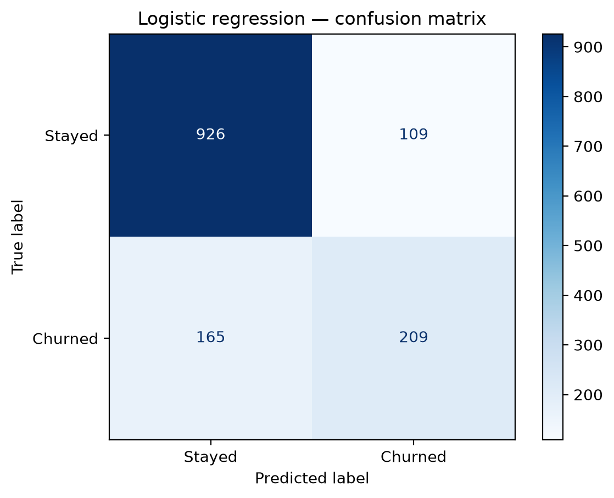
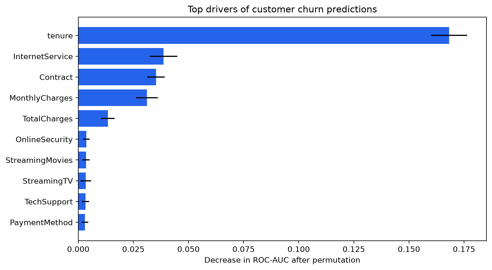
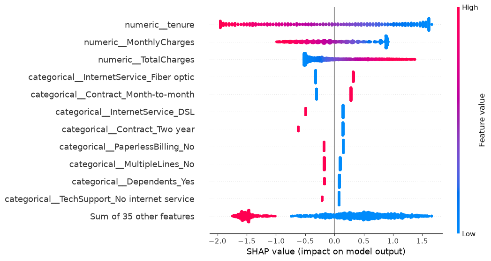

# Customer Churn Prediction

An end-to-end machine-learning project that predicts customer churn from tabular telecommunications data. The project demonstrates a reproducible workflow covering data quality, leakage-safe preprocessing, model comparison, experiment tracking and model interpretation.

## Business objective

Identify customers at higher risk of churn so that a retention team can prioritize proactive interventions.

## Results

The selected model is logistic regression, chosen after stratified 5-fold cross-validation because it performed as well as or slightly better than a random forest while remaining easier to interpret.

| Metric | Result |
|---|---:|
| Cross-validation ROC-AUC | 0.846 |
| Test ROC-AUC | 0.842 |
| Test accuracy | 0.806 |
| Test precision | 0.657 |
| Test recall | 0.559 |
| Test F1 score | 0.604 |

The close agreement between cross-validation and held-out test ROC-AUC indicates consistent performance on unseen data.

## Model interpretation

### Confusion matrix



### Global feature importance



### SHAP explanation



The model identifies tenure, contract type, internet service and billing-related characteristics as influential predictive signals. These explanations describe model associations rather than causal effects.

## Project structure

```text
customer-churn-ml/
├── data/
│   ├── raw/                         # Downloaded source data (not versioned)
│   └── processed/                   # Derived data (not versioned)
├── notebooks/
│   ├── 01_data_understanding.ipynb
│   ├── 02_preprocessing_and_baseline.ipynb
│   ├── 03_model_experiments_mlflow.ipynb
│   ├── 04_model_interpretation.ipynb
│   └── 05_business_summary.ipynb
├── reports/
├── src/
├── tests/
├── requirements.txt
└── README.md
```

## Workflow

1. Inspect data quality, target balance and feature types.
2. Create a reproducible train/test split using stratification.
3. Convert invalid `TotalCharges` values to missing numeric values.
4. Build a leakage-safe preprocessing pipeline:
   - Median imputation and scaling for numeric features.
   - Most-frequent imputation and one-hot encoding for categorical features.
5. Compare logistic regression and random forest using stratified 5-fold cross-validation.
6. Track candidate experiments and final test metrics with MLflow.
7. Interpret the selected model with a confusion matrix, permutation importance and SHAP.
8. Translate technical findings into retention recommendations.

## Main predictive signals

The interpretation analyses highlighted several customer characteristics associated with churn predictions:

- Lower tenure was the strongest predictive signal of higher risk.
- Month-to-month contracts and fiber-optic service were frequently associated with increased predicted risk.
- Contract, billing, payment and support-related features also contributed to the predictions.

These are predictive associations, not causal evidence.

## Technology

- Python
- pandas and NumPy
- scikit-learn
- MLflow
- SHAP
- matplotlib and seaborn
- pytest
- Git and GitHub

## Run locally

```bash
python -m venv .venv
```

Activate the environment:

```powershell
.\.venv\Scripts\Activate.ps1
```

Install dependencies:

```bash
pip install -r requirements.txt
```

Download the public dataset into `data/raw/telco_customer_churn.csv`, then run the notebooks in numerical order.

## Data source

This project uses IBM's public fictional [Telco Customer Churn dataset](https://github.com/IBM/telco-customer-churn-on-icp4d/tree/master/data). It is used for educational and portfolio purposes.

## Limitations and next steps

- The source is a public fictional dataset and may not represent a real customer population.
- Model explanations describe learned associations, not causal effects.
- A production deployment should select its decision threshold based on intervention cost and customer value.
- Production systems need monitoring for data drift, model performance and calibration over time.
- Retention actions should be evaluated with controlled experiments.